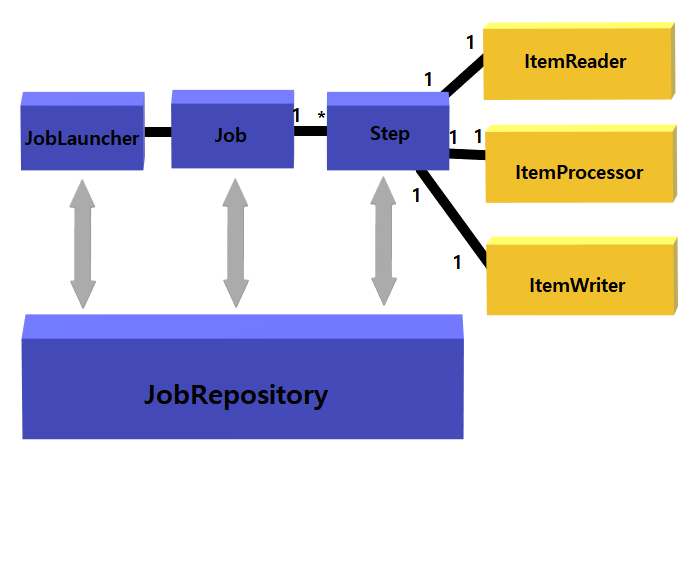
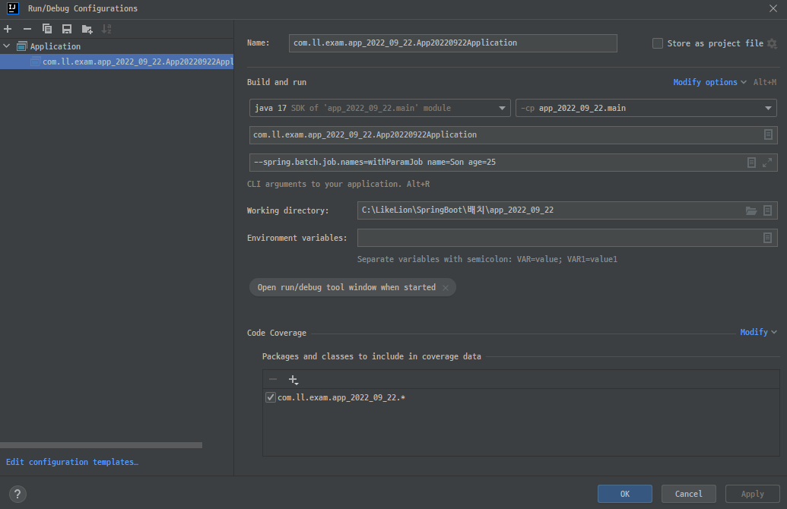

## 🏷️스프링배치
#### 🔻학습내용
* 상호작용이 필요한가?
    - O => 일반 웹 앱
    - X => 배치(일괄) 앱

* 스프링배치 개요

* 스프링배치는 한번 실행하면 꺼진다. 

* 기본적으로 job은 조건이 똑같으면 진행하지 않는다.

* 스프링 생명주기
  - 싱글톤 ➡️ 스프링부트앱이 꺼지기 전까지 살아있음.
  - 세션 ➡️ 브라우저당 객체가 1개씩 만들어짐.
  - 리퀘스트 ➡️ 요청당 객체가 1개.
  - 프로토타입 ➡️ 매번 새로 만든다.

* 프로그램 파라미터
  - ex) --spring.batch.job.names=withParamJob name="홍 길동" age=25

* Spring Batch 잡 파라미터 타입
  - Double
  - Long
  - String
  - Date
      

